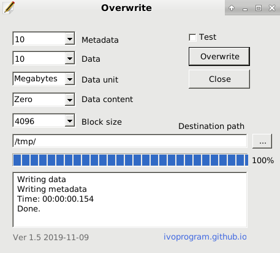
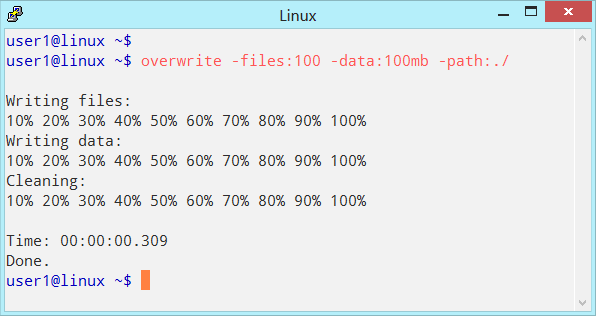
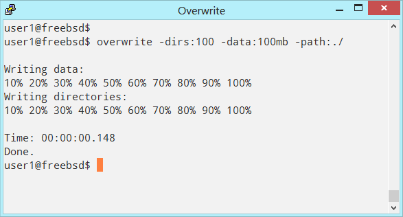
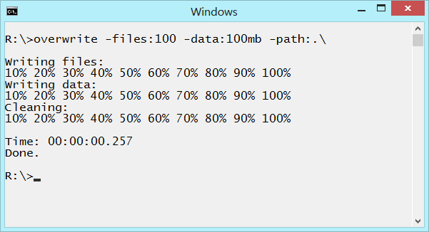

# Overwrite
Overwrite is a program that overwrites empty space on disk data and metadata.

**Documentation:** \
[https://ivoprogram.github.io?content=overwrite.html](https://ivoprogram.github.io?content=overwrite.html)

The empty space on disks can contain sensitive data and information that can be recovered with recovery software and forensic, this can be security and privacy risk. \
To protect privacy and security the remaining data on empty space on disks has to be overwritten.

**Features**
- It is safe, does not overwrite existing files, and uses operating system for overwrite.
- Can be used on different file systems and operating systems, as NTFS EXT4 FAT Windows Linux.
- Different options can be specified, as block size, number of files, quantity of data.
- It is free and open source with general public licence.

**Example**
- Write 10 dirs and 10Mb data, on Windows \
overwrite -dirs:10 -data:10mb -path:c:\

- Write random data, block size 512 bytes on Linux \
overwrite -rand -block:512 -data:10mb -path:/mnt/usbdisk/

- Run directly overwrite.c source code with Tiny C compiler \
tcc -run overwrite.c -h

**Issues** \
The issues and testing for this project has been moved to link: \
https://github.com/ivoprogram/overwrite-testing

